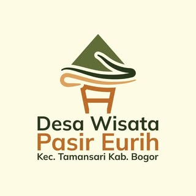
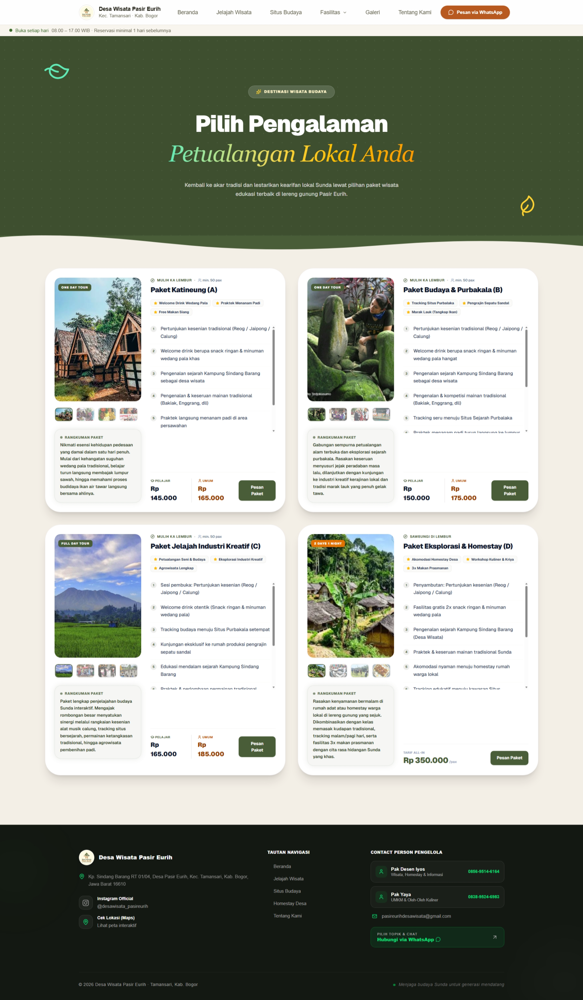
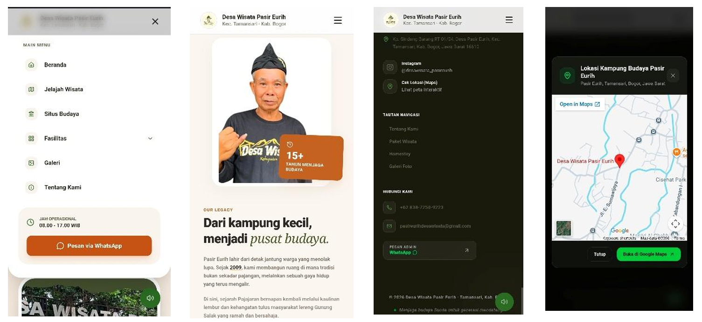

<div align="center">



# Desa Wisata Pasir Eurih Website

A modern and responsive tourism website built to support the digitalization of **Desa Wisata Pasir Eurih**, providing visitors with easy access to tourism information, local businesses, and village services.

<p>
<a href="https://desa-wisata-pasir-eurih.vercel.app"><strong>Live Demo</strong></a>
</p>

</div>

---

## Overview

The **Desa Wisata Pasir Eurih Website** is a web-based tourism platform designed to improve the accessibility of information about Desa Wisata Pasir Eurih. The website introduces visitors to the village's attractions, culinary UMKM, accommodations, facilities, galleries, and cultural experiences through a modern and responsive interface.

This repository represents **my contribution as a Frontend Developer**. My primary responsibilities focused on translating design requirements into interactive web pages, developing reusable UI components, and ensuring the application delivers a consistent experience across different devices.

---

## My Contribution

As a **Frontend Developer**, I was responsible for:

- Developing responsive user interfaces using **Next.js** and **Tailwind CSS**
- Implementing pages based on project requirements and UI designs
- Building reusable React components
- Maintaining consistent layouts and styling across the application
- Optimizing the user interface for desktop, tablet, and mobile devices
- Collaborating with team members throughout the frontend development process


---

## Features

- Responsive web interface
- Tourism destination information
- Culinary UMKM directory
- Accommodation information
- Tourism facilities
- Village gallery
- Contact information
- SEO-friendly rendering with Next.js

---

## Application Preview

### Home Page

The landing page introduces Desa Wisata Pasir Eurih through a modern interface, highlighting featured destinations, village information, and quick access to key sections of the website.

<p align="center">
  
</p>

### Tourism Attractions

Displays tourism attractions available in Desa Wisata Pasir Eurih, allowing visitors to explore destinations through a clean and informative interface.

<p align="center">
  
</p>

### Culinary UMKM

Provides information about local culinary businesses, helping visitors discover traditional foods and local products offered by village entrepreneurs.

<p align="center">
  
</p>

### Cultural Heritage Sites

Presents historical and cultural landmarks of Desa Wisata Pasir Eurih, allowing visitors to learn about the village's cultural heritage through detailed and engaging content.

<p align="center">
  
</p>


### Mobile View

The website is fully responsive, ensuring a consistent and user-friendly experience across desktop, tablet, and mobile devices.

<p align="center">
  
</p>

## Project Structure

```text
src
├── app
├── components
├── hooks
├── lib
├── public
├── styles
├── types
└── utils
```

---

## Getting Started

Clone the repository

```bash
git clone https://github.com/zahrtsa/desa-wisata-pasir-eurih.git
```

Navigate to the project directory

```bash
cd desa-wisata-pasir-eurih
```

Install dependencies

```bash
npm install
```

Run the development server

```bash
npm run dev
```

Visit

```
http://localhost:3000
```

---

## Project Highlights

- Built using the latest **Next.js App Router**
- Responsive layouts with **Tailwind CSS**
- Component-based architecture using **React**
- Clean and maintainable frontend structure
- Deployed on **Vercel**

---

## Learning Outcomes

This project strengthened my understanding of:

- Frontend development using Next.js
- Responsive web design
- React component architecture
- Tailwind CSS
- Team collaboration in software development
- Version control using Git & GitHub
- Web deployment using Vercel

---

## Contact

**Zahra Tsabitah**

📧 ev.tsabitah@gmail.com

💼 https://linkedin.com/in/zahratsabitah

🐙 https://github.com/zahrtsa

---

## Built With

<div align="center">

[](https://nextjs.org/)
[](https://react.dev/)
[](https://tailwindcss.com/)
[](https://www.typescriptlang.org/)
[](https://vercel.com/)

</div>